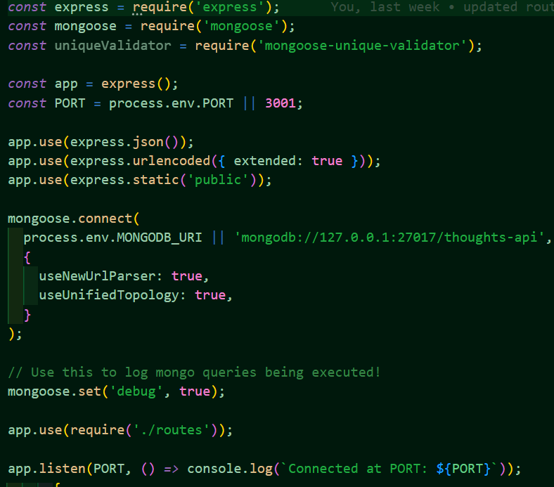
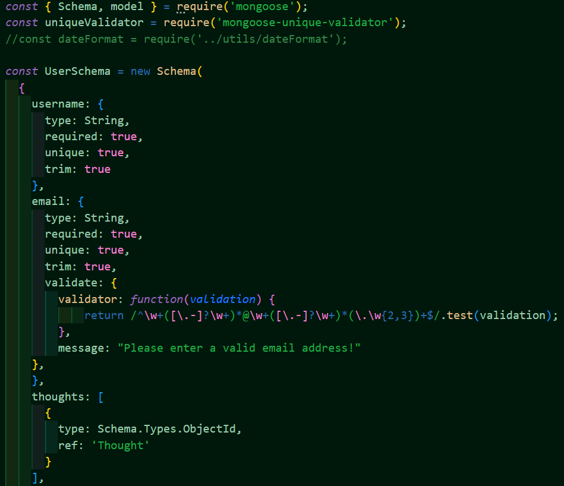

# Social Network API

The Social Network API

## Description

The Social Network API was created to allow users to share posts, called 'thoughts', react to their friend's thoughts, and create and maintain a friend's list.

## Technologies Used

- Javascript
- Express
- Mongoose package
- MongoDB
- Insomnia

## Usage and Website

[The Social Network API](https://github.com/kirstgonz/social-network-api) helps users post their thoughts and ideas and allows for interacting with others. Users can add or delete friends and react to friend's posts. 

If you want to run this application from the command line, you must first install all the dependencies through the command line by typing in 'npm init -y', 'npm i', and then run 'npm start'. The routes can then be tested through the Insomnia application.

A video walkthrough can be found [here](https://drive.google.com/file/d/1u-vS-UZhS0ajj2MrsXVXF5Vpa1SladZB/view?usp=sharing).

Below is a some code for setting up the server.

Below is an example of the code used to create a model for the user schema.

## Credits

Built by 
[Kirstyn Gonzalez](https://github.com/kirstgonz)

## License

[https://choosealicense.com/](https://choosealicense.com/).